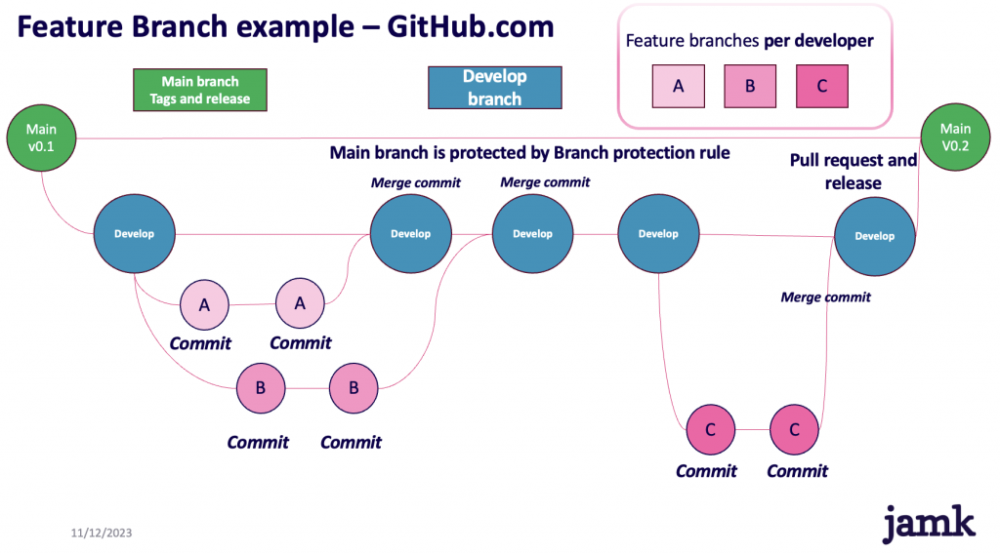
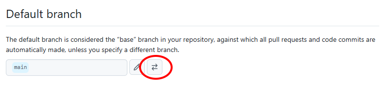
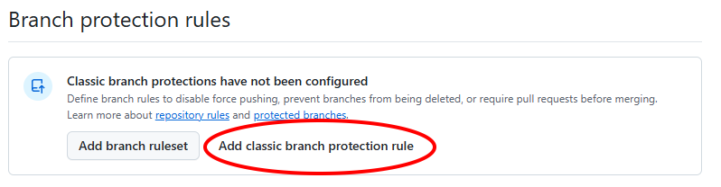
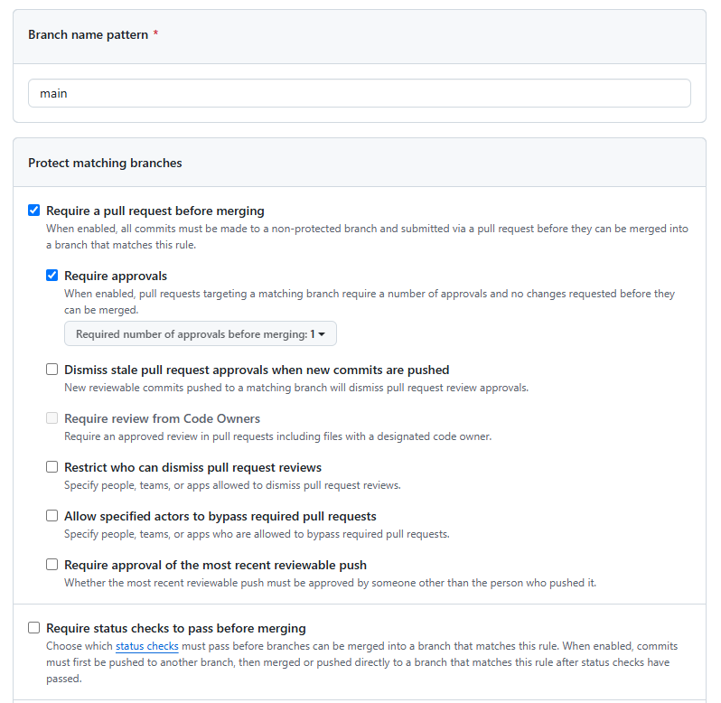
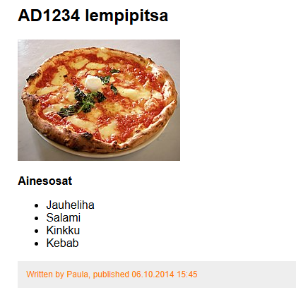
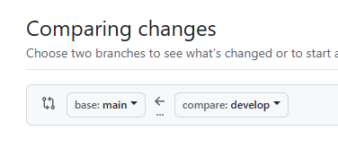
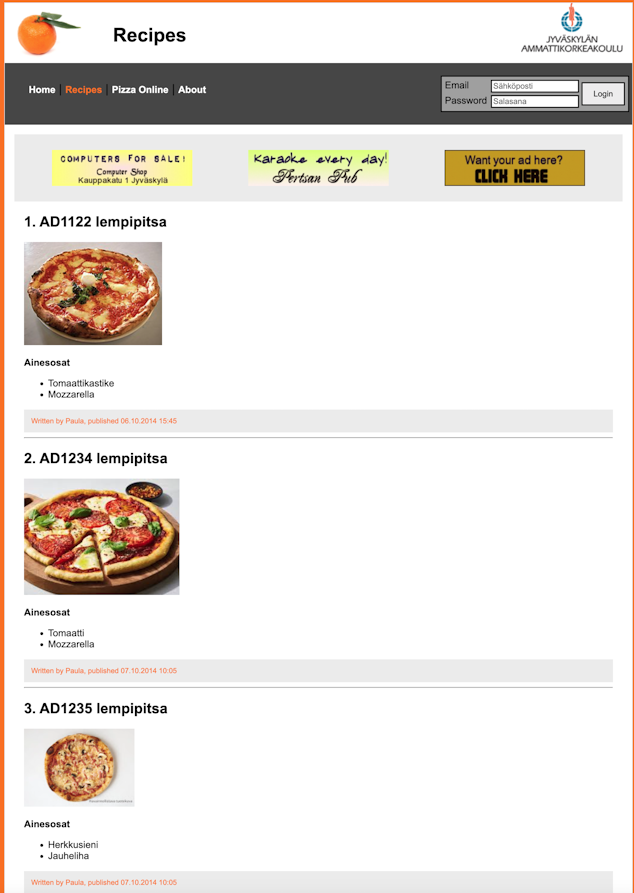
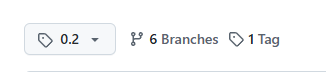

# Tehtävä 10: Feature Branch

 **Feature Branch** -termillä tarkoitetaan kehityshaaraa, joka on yksittäisen kehittäjän omassa käytössä sovelluksen tietyn osan kehittämistä varten. Yleensä kehitystiimin jokaisella kehittäjällä on oma haara, josta muutokset yhdistetään tiimin yhteiseen kehityshaaraan. Alla olevasta kuvasta näet projektipuun, jossa kehittäjät A, B ja C työskentelevät eri haaroilla. 



 Tässä tehtävässä harjoitellaan Feature Branch -workflowia. Tehtävä on Git-osion viimeinen ja siinä sovelletaan kaikkea kurssilla opittua, eli kaikkia tehtävän suorittamiseen tarvittavia komentoja ei tehtävänannossa kerrota. Tehtävän rakenne on seuraava:

- Repositoriossa on aiemmista tehtävistä tuttu pitseria-sivusto
- Valitkaa ryhmästä **yksi** jäsen, joka tekee repositorion **main**-haarasta erillisen **develop**-haaran ja asettaa sen oletushaaraksi
- Integroikaa **Slack**-kanavanne tämän repositorion ja yhteisen Trello-taulun kanssa
- Jokainen ryhmän jäsen luo itselleen repositorioon oman kehityshaaran, jonka nimeksi annetaan **oma opiskelijatunnus**
- Omalla haarallaan kukin ryhmän jäsen lisää **recipe.html**-tiedostoon suosikkipitsansa annettuun kohtaan, ja allekirjoittaa sen **omalla opiskelijatunnuksellaan**
- Jokainen ryhmän jäsen yhdistää muutoksena **develop**-haaraan
- Tämän jälkeen **develop**-haaran muutokset yhdistetään takaisin **main**-haaraan Pull request-ominaisuutta käyttäen

Tarkemmat ohjeet tehtävän suorittamiseen alla:

Yksi ryhmän jäsenistä luo tehtävärepositorioon uuden **main**-haaraan pohjautuvan haaran nimeltä **develop**. Tätä ennen on hyvä varmistaa aina, että paikallinen main-haara on ajan tasalla etärepositorion main-haaran kanssa.

```
$ git checkout main
$ git fetch origin
$ git reset --hard origin/main
```

Tämän jälkeen luodaan **develop** -niminen haara, joka pushataan tuttuun tapaan etärepositorioon.

```
$ git checkout -b develop
$ git push -u origin develop
```

Seuraavaksi asettakaa GitHubissa tehtävärepositorion oletushaaraksi (default branch) **develop**. Tämä onnistuu repositorion **Settings**-välilehdeltä, jonka etusivulta asetatte *Default Branch*-otsikon alta **main**in tilalle **develop**. Olkaa tarkkana, että vaihdatte oletushaaran alla olevassa kuvassa korostetusta painikkeesta.



Tämän jälkeen on aiheellista tehdä **main**-haaralle muutama suojaustoimenpide. Valitse **Settings**-välilehden sivupalkista **Branches** ja tästä valikosta valitse **Add classic branch protection rule**. Aseta **Branch name pattern**-kohdan arvoksi *main* ja laita rastit ruutuihin **Require a pull request before merging** sekä  **Require approvals**.




Nämä asetukset estävät suorat commitit **main**-haaraan. Haaraan ei myöskään voi tehdä mergeä ilman **pull request**ia, joka käy tarkistettavana ja hyväksyttävänä toisella kehittäjällä.

Kun **main**-haara on suojattu, kaikki ryhmän jäsenet voivat kloonata repositorion itselleen ja tarkistaa, että se on ajan tasalla. Tämän jälkeen **jokainen ryhmän jäsen** luo **develop**-haarasta itselleen oman kehityshaaran, jonka nimeksi annetaan ***oma opiskelijatunnus***. Oman opiskelijatunnuksen käyttäminen on tärkeää, sillä sitä käytetään tehtävän automaattisessa tarkastamisessa.

```
$ git clone https://github.com/Tiko-web-and-data/git-perusteet-10-public-<ryhmän_nimi>
```
Seuraavaksi leivotaan pitsaa:

1. Siirry juuri luomallesi haaralle ``git checkout``-komennolla.
2. Avaa **recipe.html** ja näet siellä viisi kohtaa pitsaresepteille.
3. Päättäkää ryhmän kesken kuka ottaa minkäkin numeron ja jokainen lisää suosikkitäytteensä otsikon alle omalla kehityshaarallaan.
4. Kirjoita reseptin otsikkoon ***oma opiskelijatunnus***, tämä on tärkeä vaihe tehtävän tarkastamista varten.
5. Tallenna muutokset ja tee commit
6. Pushaa **oma kehityshaarasi** Github-etärepositorioon (korvaa ad1234 oman haarasi nimellä)
    ```
    $ git push -u origin ad1234
    ```
7. Yhdistä omalla haarallasi tehdyt muutokset **develop**-haaraan
    ```
    $ git checkout develop
    $ git pull
    $ git merge ad1234
    $ git push
    ```

Esimerkkikuva muokatusta **recipe.html**-tiedostosta:




Kun kaikki ryhmän jäsenet ovat yhdistäneet tekemänsä muutokset **develop**-haaraan, on aika yhdistää muutokset **main**-haaraan. Valitkaa ryhmästänne jäsen, joka tekee [Pull Request](https://docs.github.com/en/pull-requests/collaborating-with-pull-requests/proposing-changes-to-your-work-with-pull-requests/creating-a-pull-request)-pyynnön, jolla yhdistetään **develop**-haara **main**-haaraan. Olkaa tarkkana, että valitsette **base**-haaraksi haaran, **johon haluatte tehdä muutokset** ja **compare**-haaraksi haaran, **josta muutokset tulevat**.



Aiemmin asetimme **main**-haaralle suojastoimenpiteitä. Kehitystiimin yhden muun jäsenen täytyy 1) käydä arvioimassa ja hyväksymässä repositorioon tehty **pull request** sekä 2) hyväksymässä **merge**. Alla esimerkkikuva siitä, miltä **main**-haaran **recipe.html**-tiedoston tulisi näyttää mergen jälkeen:



Kun merge on suoritettu, tehkää **main**-haarasta uusi **julkaisu** antamalla repositoriolle etusivulta uusi **tag**. Antakaa julkaisulle versioksi **v0.2**



Tarkastakaa lopuksi actions-välilehdeltä, että ovatko testit menneet onnistuneesti läpi. Mikäli on, tehtävä on suoritettu onnistuneesti. Mikäli testit eivät ole menneet läpi, varmistakaa, että kaikki ryhmän jäsenet ovat pushanneet etärepositorioon oman kehityshaaransa ja että jokainen on lisännyt oman pitsareseptinsä recipe.html-tiedostoon.